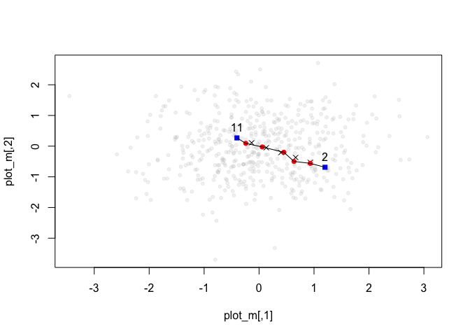

<!-- README.md is generated from README.Rmd. Please edit that file -->
pathway
=======

[](https://www.tidyverse.org/lifecycle/#experimental)

pathway finds a pathway of observations between two points in a matrix.

Installation
------------

You can install pathway from GitHub with:

``` r
# install.packages("devtools")
devtools::install_github("mdlincoln/pathway")
```

Example
-------

``` r
library(pathway)

set.seed(34)
m <- matrix(rnorm(1000), nrow = 500, ncol = 2)
p1 <- 2L
p2 <- 11L
p <- matrix_pathway(m, p1, p2, k = 3L)
p
#> $line
#>             [,1]        [,2]
#> [1,]  0.87927430 -0.49718374
#> [2,]  0.55873570 -0.30590021
#> [3,]  0.23819710 -0.11461668
#> [4,] -0.08234149  0.07666685
#> 
#> $i
#> [1] 227 221 103 335
#> 
#> $ni
#>      501 502 503 504
#> [1,] 227 221  66 134
#> [2,]  56  90 103 253
#> [3,]  86 419 114 335
#> 
#> $p1
#> [1] 2
#> 
#> $p2
#> [1] 11

plot_pathway(m, p)
```


