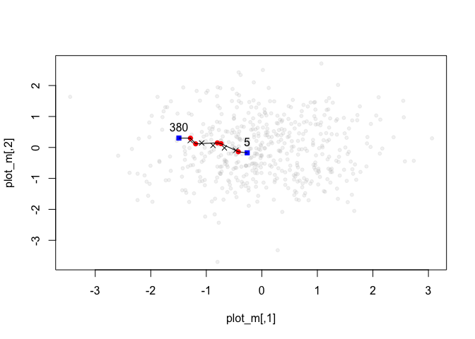

<!-- README.md is generated from README.Rmd. Please edit that file -->

# pathway

[](https://www.tidyverse.org/lifecycle/#experimental)
[](https://travis-ci.org/mdlincoln/pathway)
[](https://ci.appveyor.com/project/mdlincoln/pathway)

pathway finds a pathway of observations between two points in a matrix.

## Installation

You can install pathway from GitHub with:

``` r
# install.packages("devtools")
devtools::install_github("mdlincoln/pathway")
```

## Example

``` r
library(pathway)

set.seed(34)
m <- matrix(rnorm(1000), nrow = 500, ncol = 2)
p1 <- 2L
p2 <- 11L
p <- pathway(m, p1, p2, n = 5)
# Returns both the ideal points between p1 and p2
p$line
#>            [,1]       [,2]
#> [1,]  0.9326974 -0.5290643
#> [2,]  0.6655819 -0.3696614
#> [3,]  0.3984664 -0.2102584
#> [4,]  0.1313509 -0.0508555
#> [5,] -0.1357646  0.1085474
# as well as the indices of the nearest neighbors
p$i
#> [1] 227 495 419 479 451

plot_pathway(m, p)
```

<!-- -->

It is also possible to place conditional restraints on the solution that
`pathway` finds by using `navigate_` functions. For example,
`navigate_unique` will not revisit the same point along a path, and
`navigate_ordered` will only look at points that occurr in later rows in
the matrix.

``` r
p_ordered <- pathway(m, 5, 380, n = 5, navigator = navigate_ordered)
p_ordered$i
#> [1]  75 279 362 367 370
plot_pathway(m, p_ordered)
```

<!-- -->

To use your own predicate function, define a function that returns a
vector of indices to search and call it with `navigator =
navigate(f)`

``` r
obs_types <- sample(c("setosa", "versicolor", "virginica"), 500, replace = TRUE)

# A custom predicate function must take the original matrix, the list of
# previously-selected pathway points, along with p1 and p2.
different_species <- function(x, pi, p1, p2, obs_types) {
  if (is.null(pi)) {
    search_space <- 1:nrow(x)
  } else {
    # Only search observations that do not have the same species as the immediately previous one.
    prev_type <- obs_types[tail(pi, 1)]
    search_space <- which(obs_types != prev_type)
  }
  
  # Don't forget to exclude p1 and p2
  setdiff(search_space, c(p1, p2))
}

p_species <- pathway(m, p1, p2, n = 8, navigator = navigate(different_species, obs_types))
obs_types[p_species$i]
#> [1] "versicolor" "setosa"     "virginica"  "versicolor" "setosa"    
#> [6] "versicolor" "virginica"  "setosa"
```
